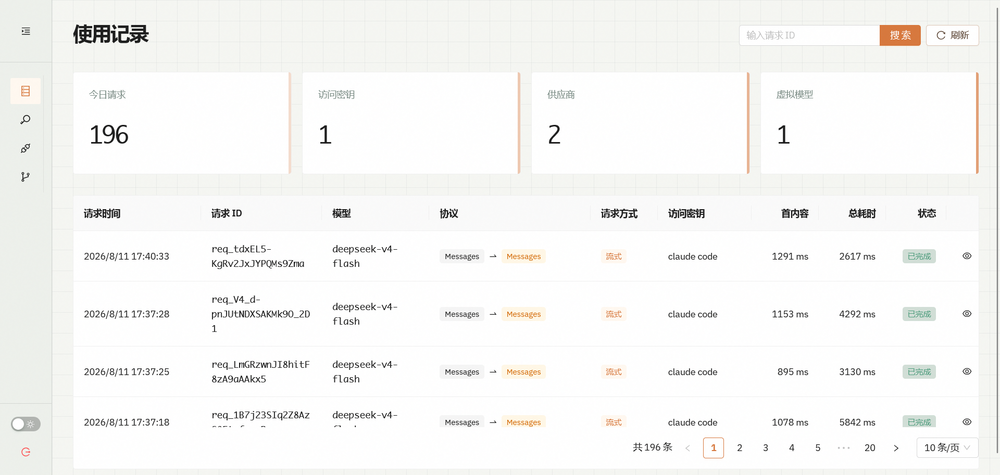
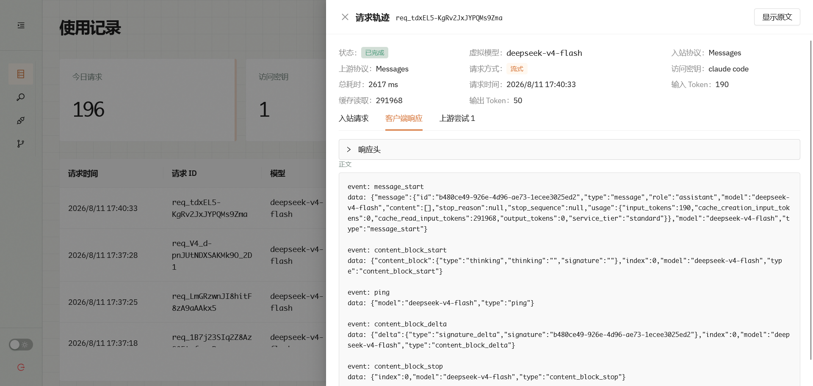
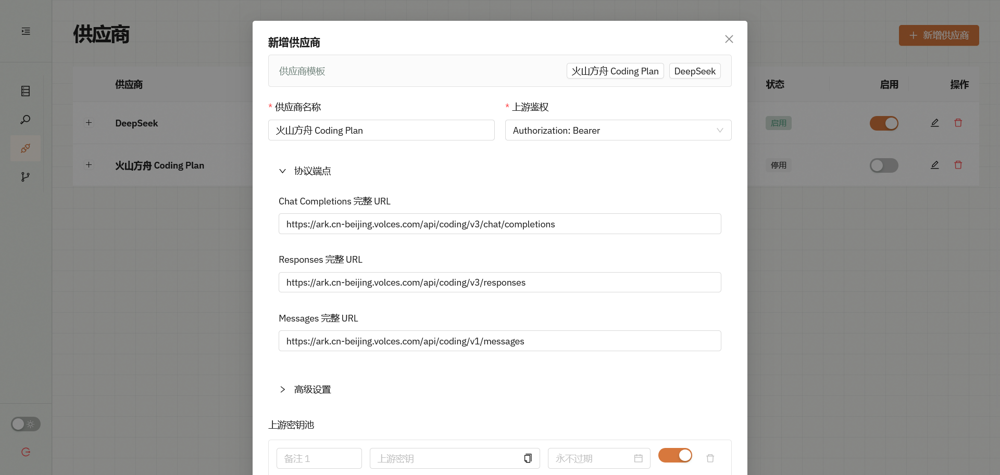
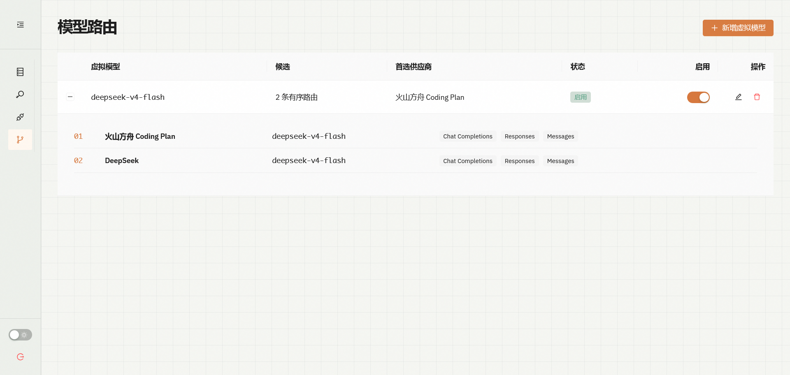

<p align="center">
  
</p>

# 模汇（model-confluence）

模汇是一款面向个人私有部署的 AI 协议网关。它为 Codex、Claude Code 和 OpenAI 兼容客户端提供统一入口，在 OpenAI Chat Completions、OpenAI Responses 与 Anthropic Messages 之间自动转换协议，并通过 SQLite 记录请求、上游尝试、Token 用量和延迟。

项目采用 Go + React + TypeScript 开发。正式构建时，管理后台会嵌入 Go 可执行文件，运行时只需要一个可执行文件和一个数据目录。

> 当前实现以本 README 为准，完整产品边界和设计取舍见 [docs/requirements.md](docs/requirements.md)。

## 界面预览

> 请使用演示数据截图，避免暴露真实访问密钥、供应商密钥和请求内容。

### 使用记录



### 请求详情



### 供应商管理



### 模型路由



## 核心能力

- 统一提供 `/v1/chat/completions`、`/v1/responses`、`/v1/messages` 和 `/v1/models`。
- 支持 Chat Completions、Responses、Messages 三种协议的九种入站/上游组合。
- 支持流式 SSE、非流式文本、推理内容和客户端工具调用的协议转换。
- 通过虚拟模型隐藏真实供应商模型名，并按候选与协议顺序路由。
- 顺序管理供应商密钥池，在鉴权、限流、额度及上游错误时切换。
- 完整记录入站请求、转换后的上游请求、上游响应、客户端响应和耗时。
- 提供访问密钥、供应商、模型路由和使用记录管理界面。
- 使用记录支持请求 ID 搜索、服务端分页、请求详情和凭据遮罩查看。
- 内置火山方舟 Coding Plan 与 DeepSeek 供应商模板。
- 使用 SQLite WAL 持久化配置与日志，不依赖外部数据库。

协议转换只覆盖三种协议之间可明确对应的公共能力。供应商私有字段、托管工具、多模态、服务端会话状态等能力不保证可以跨协议转换；同协议路由会尽量保持原始请求和响应。

## 协议路由

| 客户端入口 | 上游 Chat Completions | 上游 Responses | 上游 Messages |
| --- | --- | --- | --- |
| `/v1/chat/completions` | 治理式透传 | 双向转换 | 双向转换 |
| `/v1/responses` | 双向转换 | 治理式透传 | 双向转换 |
| `/v1/messages` | 双向转换 | 双向转换 | 治理式透传 |

治理式透传仍会替换上游鉴权和模型名、记录日志，并将响应中的真实模型名改回虚拟模型名。

## 技术栈

- 后端：Go 1.25、标准库 `net/http`
- 数据库：SQLite（`modernc.org/sqlite`，无需 CGO）
- 前端：React 19、TypeScript、Vite、Ant Design、Tailwind CSS
- 数据获取：TanStack Query

## 下载与运行

正式版本发布在 [GitHub Releases](https://github.com/Sanjeever/model-confluence/releases/latest)，包含以下文件：

| 平台 | 文件 |
| --- | --- |
| macOS Apple Silicon | `model-confluence_VERSION_darwin_arm64.tar.gz` |
| Windows 64 位 | `model-confluence_VERSION_windows_amd64.zip` |
| Linux 64 位 | `model-confluence_VERSION_linux_amd64.tar.gz` |

每个 Release 同时提供 `checksums.txt`。下载并解压后，首次使用空数据目录启动时必须设置管理员密码。

macOS 或 Linux：

```bash
chmod +x model-confluence
MODEL_CONFLUENCE_ADMIN_PASSWORD="请替换为管理员密码" ./model-confluence --listen 127.0.0.1:8080 --data-dir ./data
```

Windows PowerShell：

```powershell
$env:MODEL_CONFLUENCE_ADMIN_PASSWORD = "请替换为管理员密码"
./model-confluence.exe --listen 127.0.0.1:8080 --data-dir ./data
```

macOS 版本暂未进行 Apple Developer 签名和公证，首次运行时可能需要在系统安全设置中确认打开。

## Docker

Docker 镜像发布到 GitHub Container Registry，同时支持 Linux `amd64` 和 `arm64`：

```text
ghcr.io/sanjeever/model-confluence
```

使用命名卷保存 SQLite 数据，并只在本机暴露管理端口：

```bash
docker run -d --name model-confluence -p 127.0.0.1:8080:8080 -v model-confluence-data:/data -e MODEL_CONFLUENCE_ADMIN_PASSWORD="请替换为管理员密码" ghcr.io/sanjeever/model-confluence:latest
```

使用 Docker Compose 时，新建 `compose.yaml`：

```yaml
services:
  model-confluence:
    image: ghcr.io/sanjeever/model-confluence:latest
    restart: unless-stopped
    ports:
      - "127.0.0.1:8080:8080"
    environment:
      MODEL_CONFLUENCE_ADMIN_PASSWORD: "${MODEL_CONFLUENCE_ADMIN_PASSWORD:-}"
    volumes:
      - model-confluence-data:/data

volumes:
  model-confluence-data:
```

首次启动前，在当前终端设置管理员密码：

```bash
export MODEL_CONFLUENCE_ADMIN_PASSWORD="请替换为管理员密码"
docker compose up -d
```

Windows PowerShell：

```powershell
$env:MODEL_CONFLUENCE_ADMIN_PASSWORD = "请替换为管理员密码"
docker compose up -d
```

管理员密码只在空数据卷首次初始化时使用。升级时保留 `model-confluence-data` 卷并替换镜像即可，不要同时运行多个容器访问同一个数据卷。

## 开发环境启动

需要安装：

- Go 1.25 或更高版本
- Node.js
- pnpm

首次启动空数据库时必须设置管理员密码。在项目根目录启动后端：

```powershell
$env:MODEL_CONFLUENCE_ADMIN_PASSWORD = "请替换为管理员密码"
go run ./cmd/model-confluence --listen 127.0.0.1:8080 --data-dir ./data
```

然后在另一个终端启动前端开发服务器：

```powershell
cd web
pnpm install --frozen-lockfile
pnpm dev
```

访问 <http://localhost:5173>。Vite 会将 `/api` 和 `/healthz` 代理到 `127.0.0.1:8080`。

管理员密码只在空数据库初始化时使用。数据库已经存在时，修改环境变量不会改变当前密码。

## 基本配置流程

登录管理后台后，依次完成：

1. 创建供客户端使用的访问密钥。
2. 创建供应商，填写协议端点和至少一把上游密钥；也可以先应用内置模板。
3. 创建虚拟模型，选择供应商、真实模型名和有序协议入口。
4. 使用访问密钥调用网关 API。

获取模型列表：

```powershell
curl.exe http://127.0.0.1:8080/v1/models `
  -H "Authorization: Bearer mc_your_access_key"
```

调用 Chat Completions：

```powershell
curl.exe http://127.0.0.1:8080/v1/chat/completions `
  -H "Authorization: Bearer mc_your_access_key" `
  -H "Content-Type: application/json" `
  -d '{"model":"your-virtual-model","messages":[{"role":"user","content":"你好"}],"stream":false}'
```

三个生成端点均接受以下任一种访问密钥头：

```text
Authorization: Bearer mc_...
x-api-key: mc_...
```

## 构建单文件版本

先构建前端，再构建 Go 可执行文件：

```powershell
cd web
pnpm install --frozen-lockfile
pnpm build
cd ..
go build -o model-confluence.exe ./cmd/model-confluence
```

`pnpm build` 会把前端产物写入 `internal/webui/dist`，Go 的 `embed` 会将这些文件打包进最终可执行文件。运行正式版本不需要 Node.js：

```powershell
$env:MODEL_CONFLUENCE_ADMIN_PASSWORD = "请替换为管理员密码"
./model-confluence.exe --listen 127.0.0.1:8080 --data-dir ./data
```

## 发布

推送符合 `vX.Y.Z` 格式的标签后，[发布工作流](.github/workflows/release.yml)会构建前端、运行 Go 测试、交叉编译三个平台的二进制、生成 SHA-256 校验文件、创建 GitHub Release，并发布 `linux/amd64`、`linux/arm64` Docker 镜像。

维护者发布新版本时，先确保目标提交已经位于 `main`，再创建并推送标签。例如：

```bash
git tag -a v1.1.0 -m "v1.1.0"
git push origin v1.1.0
```

## 运行参数

| 参数 | 环境变量 | 默认值 | 说明 |
| --- | --- | --- | --- |
| `--listen` | `MODEL_CONFLUENCE_LISTEN` | `127.0.0.1:8080` | HTTP 监听地址 |
| `--data-dir` | `MODEL_CONFLUENCE_DATA_DIR` | `data` | SQLite 数据目录 |
| `--admin-password` | `MODEL_CONFLUENCE_ADMIN_PASSWORD` | 空 | 首次初始化或重置密码 |
| `--trusted-proxies` | `MODEL_CONFLUENCE_TRUSTED_PROXIES` | 空 | 逗号分隔的可信代理 CIDR |
| `--connect-timeout` | — | `10s` | 上游连接超时 |
| `--response-header-timeout` | — | `5m` | 等待上游响应头超时 |
| `--stream-idle-timeout` | — | `5m` | 上游流式空闲超时 |
| `--max-request-bytes` | — | `67108864` | 入站请求体大小上限 |

健康检查：

```text
GET /healthz
```

重置管理员密码会同时撤销现有登录会话：

```powershell
$env:MODEL_CONFLUENCE_ADMIN_PASSWORD = "新的管理员密码"
go run ./cmd/model-confluence admin reset-password --data-dir ./data
```

执行重置前应停止正在运行的服务，避免多个进程同时操作同一个 SQLite 数据库。

## 数据与安全

默认数据库路径是 `data/model-confluence.db`，同目录还可能出现 SQLite WAL 文件。

为满足本地排查和审计需求，当前版本会在 SQLite 中明文保存访问密钥、供应商密钥、请求头、请求体和响应体；管理后台也允许管理员查看完整密钥。请将数据目录视为高敏感数据：

- 只允许受信任的系统用户读取数据目录。
- 公网部署时应放在 Caddy、Nginx 等 HTTPS 反向代理之后。
- 只有配置在 `--trusted-proxies` 中的代理才能提供可信客户端 IP。
- 不要将 `data` 目录、数据库文件或带真实密钥的导出内容提交到 Git。
- 不要让多个 model-confluence 进程共享同一个数据库。

## 项目结构

```text
cmd/model-confluence/   程序入口
internal/admin/         管理 API、登录会话与 CSRF
internal/gateway/       模型入口、路由执行与上游代理
internal/protocol/      三协议请求、响应和 SSE 转换
internal/store/         SQLite 模型、迁移、路由和日志
internal/webui/         前端嵌入与构建产物
web/src/                React 管理后台源码
.github/workflows/      GitHub Actions 发布工作流
Dockerfile              多架构容器镜像构建
docs/requirements.md    首版产品需求与设计边界
```

## 开发说明

- 修改 Go 文件后使用 `gofmt` 格式化。
- 修改前端源码时不要直接编辑 `internal/webui/dist`；正式构建前运行 `pnpm build` 生成。
- 新增数据库字段时既要更新建库 schema，也要为已有数据库补充兼容迁移。
- 协议转换应保持请求与响应对称，尤其要覆盖流式事件、工具调用和多轮 reasoning/thinking 回传。
- 项目提交信息遵循 [Conventional Commits](https://www.conventionalcommits.org/en/v1.0.0/)。

## 许可证

本项目使用 [MIT License](LICENSE)。
