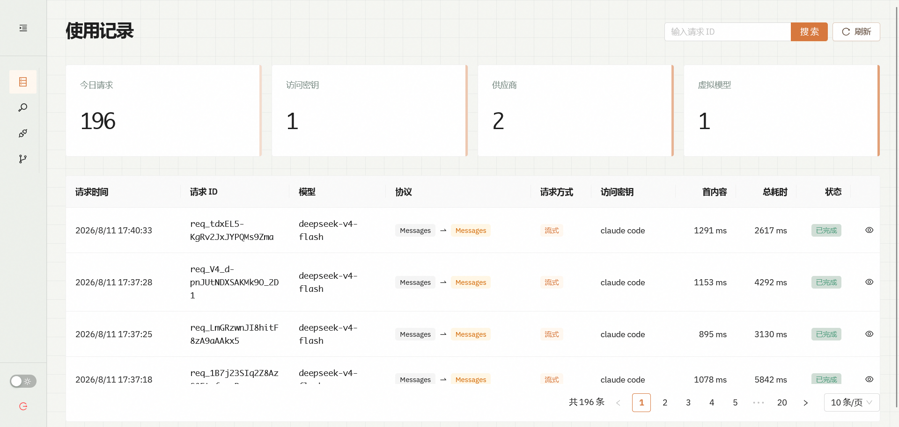
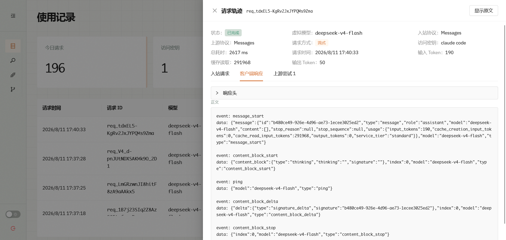
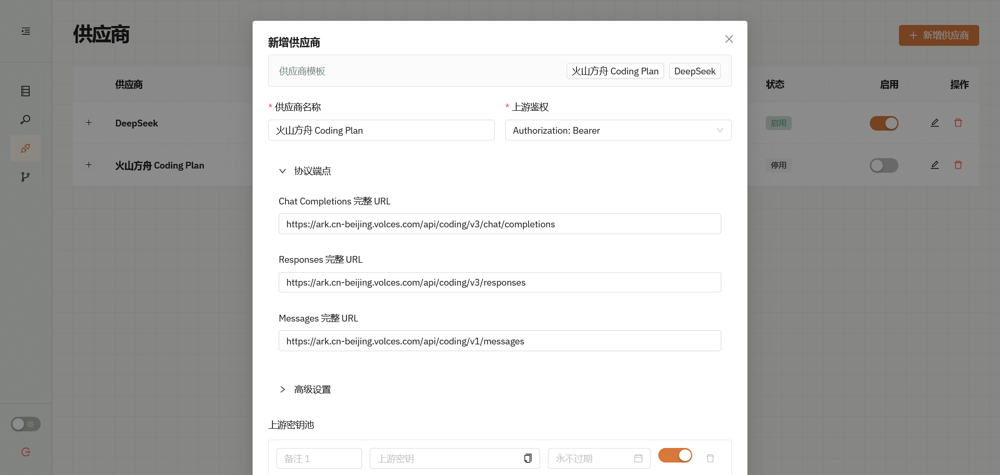
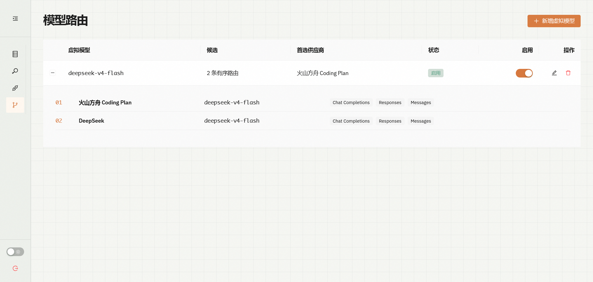

<p align="center">
  
</p>

# 模汇（model-confluence）

模汇是一款面向个人私有部署的 AI 协议网关，为 Codex、Claude Code 和 OpenAI 兼容客户端提供统一入口，在 OpenAI Chat Completions、OpenAI Responses 与 Anthropic Messages 之间转换协议，并记录请求、上游尝试、Token 用量和延迟。

项目使用 Go、React 和 TypeScript，SQLite 持久化配置与日志。正式构建内嵌管理后台，运行只需要一个可执行文件和一个数据目录。

## 核心能力

- 提供 `/v1/chat/completions`、`/v1/responses`、`/v1/messages` 和 `/v1/models`。
- 同协议治理式透传，跨协议支持非流式文本、SSE、图片输入和客户端工具调用；可转换明文推理输出，但不保证思考历史往返。
- 虚拟模型、有序候选和供应商密钥池统一管理路由，针对可切换的上游错误重试、退避和冷却。
- 保存请求与上游尝试的载荷、用量和耗时，提供使用记录、性能监控、用量统计和上游健康界面。
- 管理访问密钥、供应商和模型路由，提供供应商模板、真实模型名拉取、虚拟模型连通性测试与密钥运行状态重置。

转换覆盖可明确对应的公共能力；完整能力边界、设计契约及当前差距见 [需求与设计](docs/requirements.md)。不支持多实例共享数据库或多用户管理。

## 下载与运行

从 [GitHub Releases](https://github.com/Sanjeever/model-confluence/releases/latest) 下载对应平台的版本并解压。首次初始化空数据库需要提供管理员密码。

macOS / Linux：

```bash
chmod +x model-confluence
MODEL_CONFLUENCE_ADMIN_PASSWORD="请替换为管理员密码" ./model-confluence --listen 127.0.0.1:8080 --data-dir ./data
```

Windows PowerShell：

```powershell
$env:MODEL_CONFLUENCE_ADMIN_PASSWORD = "请替换为管理员密码"
./model-confluence.exe --listen 127.0.0.1:8080 --data-dir ./data
```

访问 <http://localhost:8080> 登录管理后台，创建访问密钥、供应商及虚拟模型后即可调用网关。初始化环境变量不会修改已有管理员密码。

数据库及管理后台包含完整密钥和请求载荷。请保护数据目录；远程访问管理后台需要 HTTPS 反向代理。Docker、Compose、API 示例、运行参数、升级及密码重置见 [运行与开发](docs/operations.md)。

## 本地开发

Go 版本要求见 [go.mod](go.mod)，Node.js 与 pnpm 可参考 [发布工作流](.github/workflows/release.yml) 中使用的版本。

在项目根目录启动后端：

```powershell
$env:MODEL_CONFLUENCE_ADMIN_PASSWORD = "请替换为管理员密码"
go run ./cmd/model-confluence --listen 127.0.0.1:8080 --data-dir ./data
```

另一个终端启动前端：

```powershell
cd web
pnpm install --frozen-lockfile
pnpm dev
```

访问 <http://localhost:5173>。普通 Go 构建提供占位页，开发后台由 Vite 提供；含管理后台的单文件构建、验证和发布说明见 [运行与开发](docs/operations.md)。

## 项目结构与文档入口

| 位置 | 职责 |
| --- | --- |
| `cmd/model-confluence`、`internal/app` | 程序生命周期、HTTP 装配与安全头 |
| `internal/config`、`internal/httpx` | 启动配置、JSON 工具与可信客户端 IP |
| `internal/admin` | 管理 API、管理员会话、CSRF 与登录限速 |
| `internal/gateway` | 入站鉴权、路由执行、上游代理与日志收尾 |
| `internal/protocol` | 三协议请求、响应、usage 与 SSE 转换 |
| `internal/store` | SQLite schema、迁移、配置、路由与日志查询 |
| `web/src`、`internal/webui` | 管理后台源码与静态资源托管 |

- [需求与设计](docs/requirements.md)：产品边界、领域概念、架构约束、安全取舍与已知实现差距。
- [运行与开发](docs/operations.md)：部署、配置、调用示例、开发、构建与发布。
- [AGENTS.md](AGENTS.md)：Coding Agent 的事实来源、范围、增量文档影响判断与完成标准。

当前实现、API 行为和配置值以相关代码、schema 和测试为依据；设计意图和长期约束以需求与设计文档为依据。文档中的验收目标不代表全部已实现。

## 界面预览

截图仅展示界面示例；更新截图时使用演示数据，避免暴露真实密钥和请求内容。

### 使用记录



### 请求详情



### 供应商管理



### 模型路由



## 许可证

本项目使用 [MIT License](LICENSE)。
